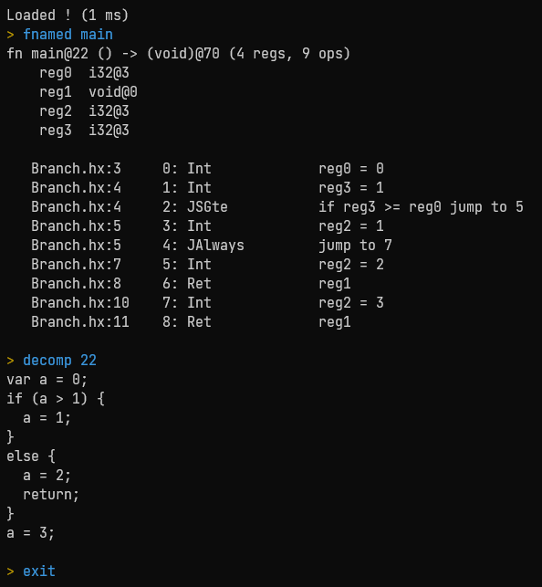

    <h1><b>H</b>ash<b>l</b>ink <b>b</b>yte<b>c</b>ode tools</h1>
    
    
    
    
     
    This repository contains a collection of Rust crates and cli tools to load, disassemble, decompile and
    analyze <a href="https://hashlink.haxe.org/">Hashlink</a> bytecode.
     
    
    

## Repository structure

- `data/` : Haxe source files to test the tools
- `hlbc/` : Core library to load and disassemble bytecode
- `hlbc-cli/` : CLI frontend for `hlbc`
- `hlbc-decompiler/` : Decompiler library
- `hlbc-derive/` : helper proc macros for hlbc
- `hlbc-gui/` : GUI to explore bytecode visually

## Wiki

A wiki detailing the specifics of Hashlink bytecode is available [here](https://github.com/Gui-Yom/hlbc/wiki) or by
using the command `wiki` in the CLI.

## Planned

- C API

## Credits

Development of this project would not have been possible without
the [hashlink](https://github.com/HaxeFoundation/hashlink) source code. Some algorithms are directly derived from the
original C code reading bytecode files.
